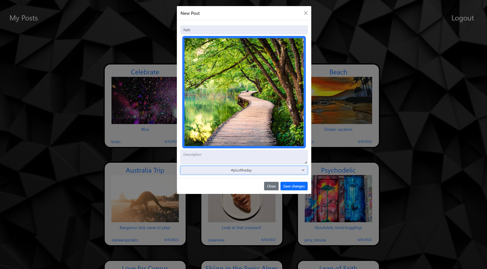

# SnapShot

## Description
SnapShot is a social media platform that allows you to share pictures with the community.  View some photos, if you see something you like, leave a comment.  Made a mistake?  No problem, you can easily edit or delete your posts and comments. 

## Table of Contents

[Links](#links)

[Media](#media)

[Installation](#installation)

[Usage](#usage)

[Contributors](#contributors)

[License](#license)

[Questions](#questions)

## Links
[SnapShot](https://snapshotban.herokuapp.com/)

## Media
The following image shows the home page: 

Screen shot of adding a new post:

## Installation
To install the necessary dependencies, run the following command:

    npm install

## Usage
Install the dependencies with npm install and run the server with npm start.  To seed the database, run the schema.sql file in the db folder and type npm run seed in the terminal.

## Contributors
[Andreas Kaiafas](https://github.com/Akaiafas526)

[NickBroglio](https://github.com/NickBroglio)

[Brian Halpin](https://github.com/bthalpin)

## License
This product is licensed under MIT.

Copyright (c) 2022 

## Questions
If you have any questions about the repo, open an issue or contact us directly at <brian.t.halpin@gmail.com>. You can find more
    of our work at [Brian Halpin](https://github.com/bthalpin), [Andreas Kaiafas](https://github.com/Akaiafas526), [NickBroglio](https://github.com/NickBroglio).
